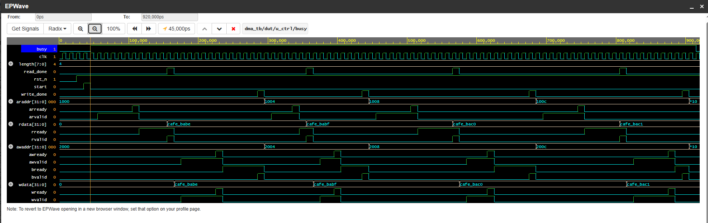

# AXI DMA Controller (SystemVerilog)

## Overview
Designed a multi-transfer AXI DMA engine supporting read-to-write data movement.

[Architecture](docs/architecture.png)

## Features
- AXI4 Read & Write Channels
- FSM-based Control (dma_ctrl)
- Multi-transfer support (length parameter)
- Address auto-increment
- Modular design (read/write/control separation)

## Verification
- Self-checking testbench
- Randomized AXI handshake timing
- Multi-transaction support

## Results
- Successfully simulated end-to-end DMA transfers
- PASS/FAIL verification messages

## Waveform

